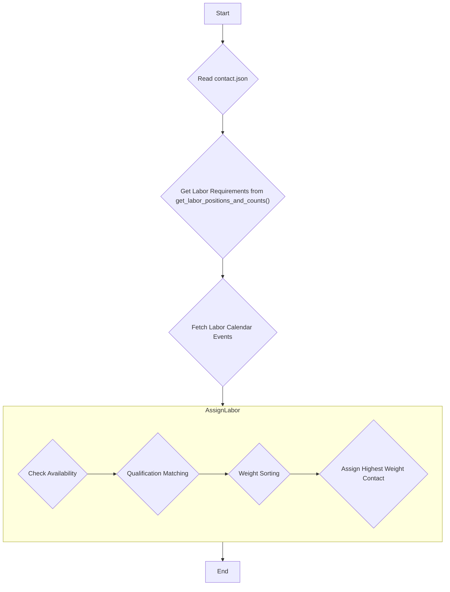

```mermaid
graph TD
    Start[Start] --> ReadContacts{"Read contact.json"}
    ReadContacts --> GetLaborReqs{"Get Labor Requirements from get_labor_positions_and_counts()"}
    GetLaborReqs --> FetchLaborEvents{"Fetch Labor Calendar Events"}
    FetchLaborEvents --> AssignLabor{"Assign Labor"}
    
    subgraph AssignLabor
        CheckAvail{"Check Availability"} --> QualMatch{"Qualification Matching"}
        QualMatch --> WeightSort{"Weight Sorting"}
        WeightSort --> HighestWeight{"Assign Highest Weight Contact"}
    end
    
    AssignLabor --> End[End]
```
